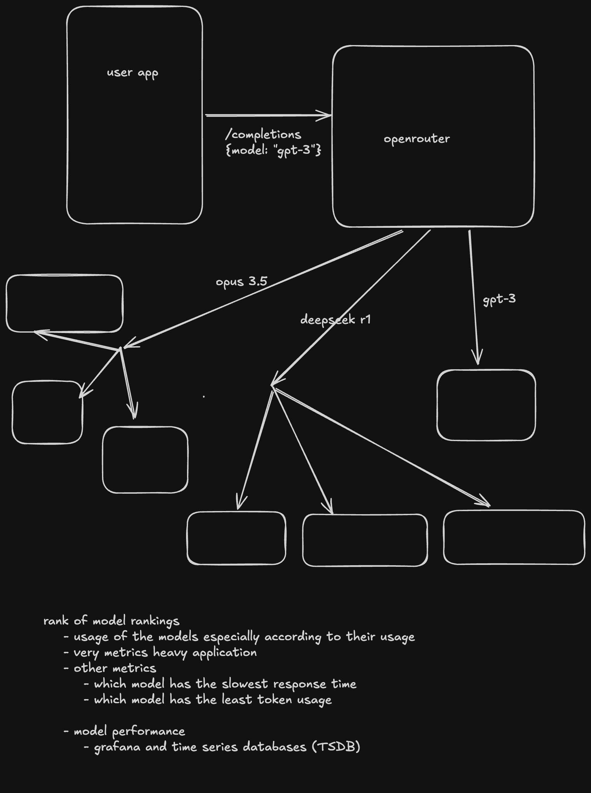

# OpenRouter



A unified API gateway for running and comparing various open-source AI models. OpenRouter provides a single interface to access multiple LLM providers (OpenAI, Anthropic Claude, Google Gemini), with built-in token usage tracking, cost management, and credit-based billing.

## Project Overview

OpenRouter solves the fragmentation problem of AI model access by offering:

- **Unified API**: Single endpoint to access multiple LLM providers
- **Token & Cost Tracking**: Automatic usage metrics and cost computation per model
- **Credit-Based Billing**: Prepaid credits system with transaction history
- **API Key Management**: Create, manage, and track usage per API key
- **Streaming Responses**: Real-time token-by-token streaming via SSE

## Tech Stack

| Layer            | Technology                                             |
| ---------------- | ------------------------------------------------------ |
| Runtime          | Bun 1.3.9                                              |
| Backend          | Express.js 4.18.2 + Zod 3.24                           |
| Frontend         | React 19 + Tailwind CSS 4                              |
| UI Components    | shadcn/ui + Radix primitives                           |
| Database         | PostgreSQL (Neon Serverless)                           |
| ORM              | Prisma 7.7.0                                           |
| Authentication   | JWT + bcrypt                                           |
| Validation       | Zod 3.24                                               |
| AI SDKs          | openai 6.x, @anthropic-ai/sdk 0.88, @google/genai 1.x |
| Data Fetching    | TanStack Query 5                                       |
| Routing          | React Router 7                                         |
| Monorepo         | Turbo 2.8.10                                           |
| Deployment       | Vercel                                                 |
| API Runtime Mode | Serverless function + static frontend                  |

## Architecture

### High-Level Architecture

```
┌─────────────────────────────────────────────────────────────────────────────┐
│                           OpenRouter System                                │
├─────────────────────────────────────────────────────────────────────────────┤
│                                                                            │
│  ┌──────────────────────────────┐      ┌──────────────────────────────┐    │
│  │   Static Frontend            │      │   Vercel API Function        │    │
│  │   React Build                │─────>│   /api/*                     │    │
│  │   apps/dashboard-frontend    │      │   Express apps mounted       │    │
│  └──────────────┬───────────────┘      └───────────┬──────────────────┘    │
│                 │                                   │                       │
│                 │ Same-origin HTTP                  │ LLM calls             │
│                 ▼                                   ▼                       │
│  ┌──────────────────────────────┐      ┌──────────────────────────────┐    │
│  │   Auth / API Keys / Models   │      │   OpenAI / Anthropic /       │    │
│  │   / Payments Routes          │      │   Gemini                     │    │
│  │   + /completions SSE         │      └──────────────────────────────┘    │
│  └──────────────┬───────────────┘                                           │
│                 │ PostgreSQL (Neon)                                         │
│                 ▼                                                            │
│  ┌──────────────────────────────┐                                           │
│  │   Prisma ORM                 │                                           │
│  │   + PostgreSQL               │                                           │
│  └──────────────────────────────┘                                           │
│                                                                            │
└─────────────────────────────────────────────────────────────────────────────┘
```

### System Components

#### Frontend

The dashboard is a React SPA built from `apps/dashboard-frontend` and deployed as a static site on Vercel. In production it talks to same-origin API routes under `/api`, which avoids hardcoded localhost ports and fixes browser cookie behavior across environments.

#### Serverless API

Vercel serves a single serverless entrypoint at `api/[...route].ts`, which mounts both Express apps:

- Primary backend routes for auth, API keys, models, and payments
- API gateway route for `/completions`
- Shared middleware for JSON parsing, cookies, and CORS

#### Primary Backend

Handles user-facing and administrative functionality:

- **Auth Module** (`/auth`): User registration, login, JWT session management
- **API Keys Module** (`/api-keys`): Create, list, update, disable, delete API keys
- **Models Module** (`/models`): Available AI models and provider listings
- **Payments Module** (`/payments`): Credit purchases and transaction history

#### API Backend

Handles LLM proxy and streaming:

- **Completions Endpoint**: Proxy requests to OpenAI/Anthropic/Gemini
- **Streaming**: Server-sent events (SSE) for real-time token delivery
- **Token Counting**: Input/output token tracking per request
- **Credit Deduction**: Automatic credit consumption via Prisma transaction

#### Local Development

Local development still runs the three apps independently:

- Authentication (sign up, sign in)
- API key management
- Credit balance and purchases
- Dashboard overview with usage stats

## Database Schema

### Entity Relationship

```
┌─────────────┐       ┌─────────────┐       ┌─────────────────────┐
│    User     │──────>│   ApiKey    │──────>│  Conversation       │
│             │       │             │       │                    │
│ - id        │       │ - id        │       │ - id                │
│ - email     │       │ - userId    │       │ - userId            │
│ - password  │       │ - apiKey   │       │ - apiKeyId          │
│ - credits   │       │ - disabled │       │ - input/output     │
│             │       │ - deleted  │       │ - token counts     │
└─────────────┘       │ - creditsConsumed  └─────────────────────┘
                      └─────────────┘              │
                                                    ▼
┌─────────────────────┐       ┌─────────────────────┐
│   OnrampTransaction │       │  ModelProviderMap   │
│                     │       │                     │
│ - id                │       │ - id                 │
│ - userId            │       │ - modelId            │
│ - amount            │       │ - providerId         │
│ - status            │       │ - inputTokenCost     │
└─────────────────────┘       │ - outputTokenCost    │
                              └──────────┬───────────┘
                                         │
                    ┌────────────────────┼────────────────────┐
                    │                    │                    │
                    ▼                    ▼                    ▼
              ┌───────────┐       ┌───────────┐       ┌───────────┐
              │ Company  │       │  Model    │       │ Provider │
              │          │       │           │       │          │
              │ - id     │       │ - id      │       │ - id     │
              │ - name   │       │ - name    │       │ - name   │
              │ - website│       │ - slug    │       │ - website│
              └─────────┘       │ - companyId      └─────────┘
                               └──────────┘
```

### Models

| Model                  | Description                                     |
| ---------------------- | ----------------------------------------------- |
| `User`                 | User accounts with credit balance               |
| `ApiKey`               | User API keys with usage tracking (soft-delete) |
| `Company`              | AI provider companies (OpenAI, Anthropic, etc.) |
| `Model`                | Available AI models with slugs                  |
| `Provider`             | LLM providers                                   |
| `ModelProviderMapping` | Cost mapping per model per provider             |
| `OnrampTransaction`    | Credit purchase transactions                    |
| `Conversation`         | Chat history with token counts                  |

## API Endpoints

### Primary Backend

| Route           | Method | Description                  |
| --------------- | ------ | ---------------------------- |
| `/auth/sign-up` | POST   | User registration            |
| `/auth/sign-in` | POST   | User login                   |
| `/auth/profile` | GET    | Get user profile (protected) |
| `/api-keys`     | POST   | Create API key (protected)   |
| `/api-keys`     | GET    | List API keys (protected)    |
| `/api-keys`     | PUT    | Update API key (protected)   |
| `/api-keys/:id` | DELETE | Delete API key (protected)   |
| `/models`       | GET    | List available models        |
| `/payments`     | GET    | Get transactions             |

### API Backend

| Route          | Method | Description                    |
| -------------- | ------ | ------------------------------ |
| `/completions` | POST   | LLM completion (SSE streaming) |

In production on Vercel, these routes are exposed as `/api/auth/*`, `/api/api-keys`, `/api/models`, `/api/payments/*`, and `/api/completions`.

## Project Structure

```
openrouter/
├── apps/
│   ├── backend/              # Primary Express backend
│   │   └── src/
│   │       ├── app.ts
│   │       ├── index.ts
│   │       ├── middleware/
│   │       └── modules/
│   │           ├── auth/
│   │           ├── apiKeys/
│   │           ├── models/
│   │           └── payments/
│   ├── api-backend/         # Express LLM gateway
│   │   └── src/
│   │       ├── app.ts
│   │       ├── index.ts
│   │       ├── types.ts
│   │       └── llms/
│   │           ├── Base.ts
│   │           ├── Openai.ts
│   │           ├── Claude.ts
│   │           └── Gemini.ts
│   └── dashboard-frontend/  # React dashboard
│       └── src/
│           ├── frontend.tsx   # React root
│           ├── pages/
│           │   ├── Landing.tsx
│           │   ├── Signin.tsx
│           │   ├── Signup.tsx
│           │   ├── Dashboard.tsx
│           │   ├── ApiKeys.tsx
│           │   └── Credits.tsx
│           ├── components/
│           └── providers/
├── api/
│   └── [...route].ts        # Vercel serverless API entrypoint
├── packages/
│   ├── db/                  # Prisma database package
│   │   ├── prisma/
│   │   │   └── schema.prisma
│   │   └── index.ts
│   ├── ui/                  # Shared React UI components
│   ├── typescript-config/   # Shared TypeScript configs
│   └── eslint-config/       # Shared ESLint configuration
├── vercel.json              # Vercel build + routing config
├── turbo.json              # Turborepo config
└── package.json
```

## Getting Started

### Prerequisites

- Bun 1.3.9+
- PostgreSQL database (Neon)

### Installation

```bash
# Install dependencies
bun install

# Generate Prisma client (also runs automatically on install/build)
bun run db:generate
```

### Development

```bash
# Run all services locally
bun run dev

# Run individual services
bun run dev --filter=backend      # Primary backend (port 3000)
bun run dev --filter=api-backend  # API gateway (port 3001)
bun run dev --filter=dashboard-frontend  # Frontend (port 9001)
```

### Environment Variables

Set these environment variables locally and in Vercel:

```env
DATABASE_URL=postgresql://...
JWT_SECRET=your-secret-key
OPENAI_API_KEY=sk-...
ANTHROPIC_API_KEY=sk-ant-...
GEMINI_API_KEY=AIza...
```

### Vercel Deployment

This repo is configured for Vercel with:

- Static frontend output from `apps/dashboard-frontend/dist`
- A single serverless API handler at `api/[...route].ts`
- SPA rewrites for client-side React Router navigation
- Prisma client generation during install/build

Deploy steps:

```bash
vercel
```

Or import the repo into Vercel and configure the environment variables listed above. The included `vercel.json` already defines the install command, build command, output directory, and SPA rewrite behavior.

## Monorepo Commands

| Command               | Description               |
| --------------------- | ------------------------- |
| `bun run build`       | Build all apps            |
| `bun run dev`         | Run all apps in dev mode  |
| `bun run lint`        | Lint all apps             |
| `bun run check-types` | TypeScript type check     |
| `bun run format`      | Format code with Prettier |
| `bun run db:generate` | Generate Prisma client    |

## License

MIT
